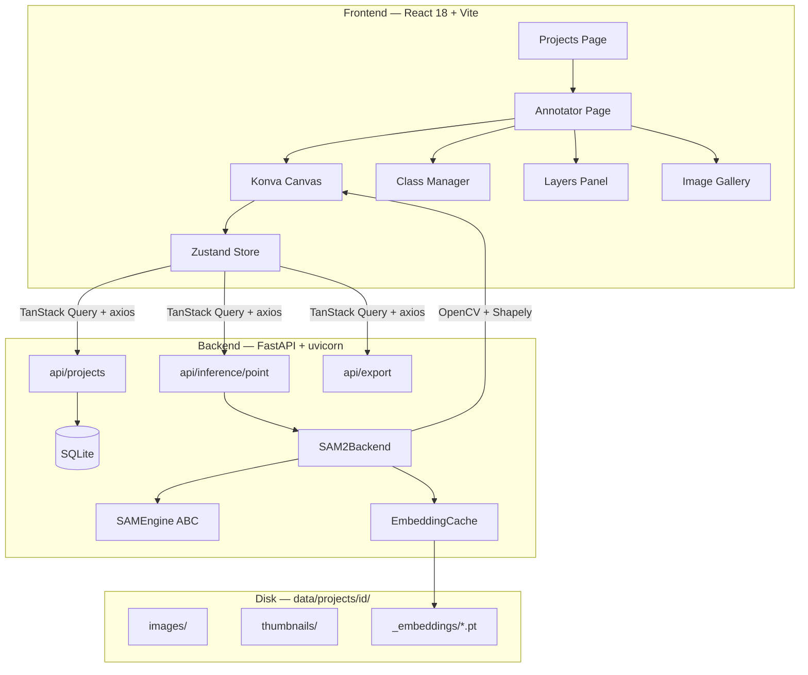

<div align="center">

# annotation-station

**Local, privacy-first annotation platform powered by Segment Anything Model 2.1**

*A self-hosted alternative to Roboflow — no data leaves your machine.*

[](https://www.python.org/)
[](https://fastapi.tiangolo.com/)
[](https://react.dev/)
[](https://pytorch.org/)
[](https://github.com/facebookresearch/sam2)
[](LICENSE)
[](https://www.microsoft.com/windows)

---

> Annotate instance segmentation masks and bounding boxes at inference speed — one click per object, GPU-accelerated, embeddings cached on disk so every subsequent click is instant.


</div>

---

## Overview

annotation-station brings the assisted-annotation workflow of commercial platforms into your local environment. It uses [SAM 2.1](https://github.com/facebookresearch/sam2) (Meta AI) as its segmentation backbone, wraps it in a FastAPI server with a three-level embedding cache, and exposes a Konva.js canvas frontend for fluid, keyboard-driven annotation.

Designed for computer vision practitioners who need to label custom datasets — particularly **multi-instance, multi-class** scenes — without uploading sensitive imagery to third-party services. Initial validation has focused on forestry imagery (tree crown and trunk segmentation in Iberian *dehesa* ecosystems), but the workflow is fully domain-agnostic.

---

## Why annotation-station

There are excellent annotation tools out there. annotation-station is not trying to replace all of them — it occupies a specific niche: **no cloud, fully local, zero telemetry**.

The table below is a **feature comparison, not a benchmark**: it is drawn from each tool's own documentation, and no timing or accuracy measurements were run against them.

| Aspect | annotation-station | Roboflow | CVAT | Label Studio |
|---|---|---|---|---|
| Data stays on your machine | Yes | No (cloud) | Yes (self-host) | Yes (self-host) |
| SAM-assisted clicks out of the box | SAM 2.1 | Yes | Plugin | Plugin |
| Setup complexity | Medium | None | High (Docker stack) | Medium |
| Cost | Free | Freemium | Free | Free |
| Runs on 4 GB VRAM laptop GPU | Yes (tiny) | N/A | Yes | Yes |

If you already live inside Roboflow and your images can leave your machine, stay there — it is a great product. annotation-station exists for the cases where they cannot.

---

## Screenshots

<div align="center">

| Home — project dashboard | Annotator — SAM segmentation |
|:---:|:---:|
|  |  |

</div>

---

## Key Features

| Feature | Details |
|---|---|
| **SAM-assisted segmentation** | Left-click positive prompts, right-click negative prompts; mask preview updates on every click |
| **Three-level embedding cache** | In-memory → disk (`.pt`) → fresh encode; avoids recomputing the image encoder on repeat visits |
| **Bounding box tool** | Manual drag-to-draw boxes with an optional SAM constraint region |
| **Negative box tool** | Draw exclusion rectangles that are densely sampled into SAM negative prompts |
| **Polygon editing** | Drag vertices, click midpoints to insert, right-click to delete — all on the Konva canvas |
| **Box editing** | Eight-handle resize for confirmed bounding boxes |
| **Class management** | Named classes with hex color picker and drag-and-drop YOLO index reordering |
| **Export pipeline** | YOLO-seg, YOLO-det, COCO JSON — configurable train/val/test splits |
| **Fully local** | Zero telemetry, zero cloud dependency; all data stored in a portable project folder |

---

## Performance

Reference numbers measured on the development machine — a mid-range laptop, intentionally chosen to validate that the tool remains usable on constrained hardware.

**Hardware:** NVIDIA RTX 3050 Laptop GPU (4 GB VRAM), Intel i7-12700H, 16 GB RAM, Windows 11, CUDA 12.8.

| Operation | Typical latency |
|---|---|
| First click on a new image (computes and caches image embedding) | 1.5 – 2.5 s |
| Subsequent clicks on the same image (cache hit) | 200 – 400 ms |
| Embedding retrieval from disk cache (previously visited image) | 10 – 30 ms |
| Polygon extraction and simplification | < 50 ms |
| VRAM footprint with SAM 2.1 tiny loaded + one active image | ~1.1 GB |

In practice this means: opening a new image has a short warm-up, after which every prompt feels instant. Revisiting a previously annotated image is instant from the start because the embedding is read from disk rather than recomputed.

Heavier SAM 2.1 variants (*small*, *base_plus*, *large*) can be slotted into the same `SAMEngine` interface without code changes if your GPU has more memory available — see the [Configuration](#configuration) section.

---

## Architecture



The `SAMEngine` abstract base class decouples the annotation pipeline from any specific SAM version. Swapping SAM 2.1 tiny for SAM 2.1 base_plus, or adding a SAM 3 backend in the future, is a matter of implementing one class.

---

## Stack

| Tool | Version | Purpose |
|---|---|---|
| Python | 3.11 | Backend runtime |
| FastAPI + uvicorn | ≥ 0.111 / ≥ 0.29 | REST API server |
| SAM 2.1 (tiny) | — | Segmentation backbone |
| PyTorch + torchvision | ≥ 2.3 | Model inference (CUDA) |
| SQLModel | ≥ 0.0.19 | SQLite ORM / persistence |
| pydantic-settings | ≥ 2.3 | Typed, `.env`-aware config |
| OpenCV + Shapely | ≥ 4.9 / ≥ 2.0 | Mask → polygon geometry |
| React 18 + Vite + Konva | — | Annotation canvas frontend |
| ruff / black / mypy / pytest | — | Lint / format / types / tests |

---

## Quick Start

> **Prerequisites:** Python 3.11 (conda or venv), Node.js 20+, NVIDIA GPU with ≥ 4 GB VRAM, CUDA 12.x driver.
> Full installation guide including troubleshooting in [`INSTALL.md`](INSTALL.md).

```bash
# 1. Clone
git clone https://github.com/Juanmaherruzo/annotation_station.git
cd annotation_station

# 2. Create the Python environment and install dependencies
conda create -n sam_studio python=3.11 -y
conda activate sam_studio
pip install torch==2.11.0+cu128 torchvision==0.26.0+cu128 --index-url https://download.pytorch.org/whl/cu128
pip install git+https://github.com/facebookresearch/sam2.git
pip install -e "backend[dev]"        # installs the app + dev tooling from pyproject.toml

# 3. Install frontend dependencies
cd frontend && npm install && cd ..

# 4. Download SAM 2.1 tiny checkpoint (~155 MB)
#    Place sam2.1_hiera_tiny.pt in the directory set by MODELS_DIR in backend/app/config.py

# 5. Launch
start.bat        # Windows — opens the browser automatically
```

First launch can take a minute while FastAPI imports PyTorch and the frontend compiles. Subsequent launches are near-instant.

**Alternative — install the backend with [uv](https://docs.astral.sh/uv/) (faster):**

```bash
cd backend
uv venv && uv pip install -e ".[dev]"
# torch/torchvision come from the optional [inference] extra:
uv pip install -e ".[inference]" --index-url https://download.pytorch.org/whl/cu128
uv pip install git+https://github.com/facebookresearch/sam2.git
```

---

## Annotation Workflow

```
Open project  →  Upload images (drag & drop)  →  Create classes  →  Annotate  →  Export
```

### SAM segmentation mode (`E`)

1. Select the active class (`1`–`9`).
2. **Left-click** on the object — SAM computes the image embedding on the first click (~1–2 s, cached for all subsequent clicks) and returns a mask preview in ~300 ms.
3. Add more positive clicks to expand the mask; **right-click** to place a negative prompt and exclude regions.
4. Press **Enter** to confirm the instance. It is written to SQLite immediately — no manual save step.
5. Press **Escape** to discard and start over.

### Bounding box mode (`B`)

Drag to draw a box. Press **Enter** to confirm. Double-click any confirmed box to enter resize mode.

### Polygon editing

Double-click any confirmed polygon. Drag vertices to reshape; click midpoints to insert new vertices; right-click a vertex to delete it (minimum 3 vertices enforced).

---

## Keyboard Reference

| Key | Action |
|---|---|
| `E` | SAM segmentation tool |
| `B` | Bounding box tool |
| `H` | Pan tool |
| `X` | Negative box tool (exclusion region) |
| `1` – `9` | Select class by index |
| `Space` | Next image |
| `Shift + Space` | Previous image |
| `Enter` | Confirm annotation / save edit |
| `Escape` | Cancel annotation / cancel edit |
| `Delete` / `Backspace` | Delete selected annotation |
| `Ctrl + Z` / `←` | Undo last SAM prompt point |
| Scroll wheel | Zoom (centered on cursor) |
| Drag (Pan tool) | Pan |

---

## Export Formats

All exports download as a `.zip` containing images, labels and metadata, split into `train/`, `val/`, and `test/` sets (default 70 / 20 / 10).

| Format | Output | Use case |
|---|---|---|
| **YOLO-seg** | Normalized polygon `.txt` + `data.yaml` | Instance segmentation training (YOLOv8/v11) |
| **YOLO-det** | `cx cy w h` `.txt` + `data.yaml` | Object detection training |
| **COCO JSON** | `instances_*.json` per split | Any COCO-compatible framework |

---

## Configuration

`backend/.env` — only non-default values need to be set:

```env
# Polygon simplification tolerance in pixels (higher = fewer vertices, faster export)
POLYGON_TOLERANCE=10.0

# Override the models directory if your checkpoints live elsewhere
# MODELS_DIR=C:\path\to\your\models
```

The SAM model variant is fixed to **tiny** in `backend/app/config.py` to stay within the 4 GB VRAM budget of laptop-class GPUs. To switch to a heavier variant, edit `SAM_CHECKPOINT` and `SAM_CONFIG` directly in that file and ensure the corresponding checkpoint is present in `MODELS_DIR`.

---

## Project Structure

```
annotation-station/
├── backend/
│   ├── app/
│   │   ├── api/            # FastAPI routers (projects, classes, images, annotations, inference, export)
│   │   ├── core/
│   │   │   ├── sam_engine.py       # Abstract SAMEngine interface
│   │   │   ├── sam2_backend.py     # SAM 2.1 implementation with embedding cache
│   │   │   ├── embedding_cache.py  # Three-level cache (memory → disk → encode)
│   │   │   ├── mask_utils.py       # mask → polygon, simplify, normalize, bbox
│   │   │   └── exporters/          # YOLOSeg, YOLODet, COCO exporters
│   │   ├── db/             # SQLModel models + session
│   │   ├── schemas/        # Pydantic request/response schemas
│   │   ├── config.py       # Settings (pydantic-settings, .env aware)
│   │   └── main.py         # App factory, lifespan, CORS
│   ├── tests/              # pytest suite (mask utils, exporters, config)
│   └── pyproject.toml      # Packaging, dependencies, tool config
├── frontend/
│   └── src/
│       ├── components/     # Canvas, ClassManager, LayersPanel, ImageGallery, ...
│       ├── pages/          # Projects, Annotator
│       ├── store/          # Zustand global state
│       └── api/            # Axios wrappers
├── data/
│   └── projects/           # Runtime — gitignored
├── assets/
│   ├── demo.gif
│   ├── Home_page.png
│   └── Annotation_example.png
├── INSTALL.md
├── start.bat               # One-click launcher (Windows)
└── Makefile
```

---

## Roadmap

Short-term priorities tracked in GitHub Issues:
- Automatic suggestion mode: SAM 2 automask for first-pass annotations
- Text prompts via a SAM 3 backend (once memory profile permits)
- Linux and macOS launcher scripts (currently Windows only)

Longer-term ideas are openly discussed in issues tagged `discussion`. Proposals are welcome even when they are not yet fully formed.

---

## Contributing

Contributions, issues, and feature requests are welcome. Please open an issue before submitting a pull request so we can discuss the approach.

This project is in active development and I am genuinely open to any form of feedback — whether that is an architectural suggestion, a workflow improvement, a bug report, or a perspective from practitioners working with different datasets or domain requirements. If you have used annotation-station in your own annotation pipeline and encountered friction, I would particularly value hearing about it.

Do not hesitate to open an issue simply to share an idea. Constructive criticism is as welcome as praise.

```bash
# Run backend in development mode
conda activate sam_studio
cd backend
uvicorn app.main:app --reload

# Run frontend in development mode
cd frontend
npm run dev
```

---

Citation
If you use this work in your research, please cite:

@software{herruzo2026annotation_station,
  author  = {Herruzo, Juan Manuel},
  title   = {annotation_station},
  year    = {2026},
  url     = {[https://github.com/Juanmaherruzo/annotation_station](https://github.com/Juanmaherruzo/annotation_station)}
}

---

## Contact

**Juan Manuel Herruzo**  
juanmherruzo@gmail.com

For commercial licensing, API access or research collaboration, get in touch.

---

## License

Distributed under the [MIT License](LICENSE).

SAM 2.1 is distributed by Meta AI under the [Apache 2.0 License](https://github.com/facebookresearch/sam2/blob/main/LICENSE).

---

<div align="center">
Built for computer vision practitioners who value data privacy and workflow speed.
</div>
